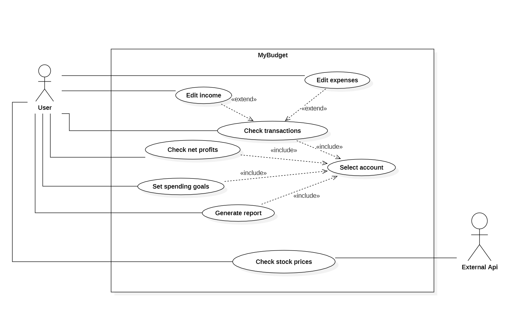
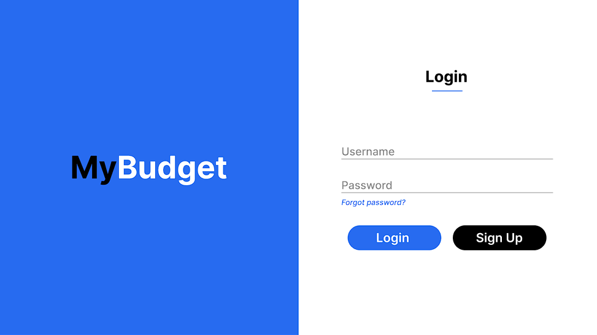
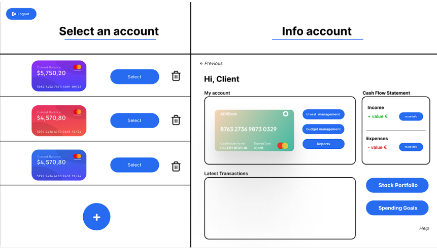
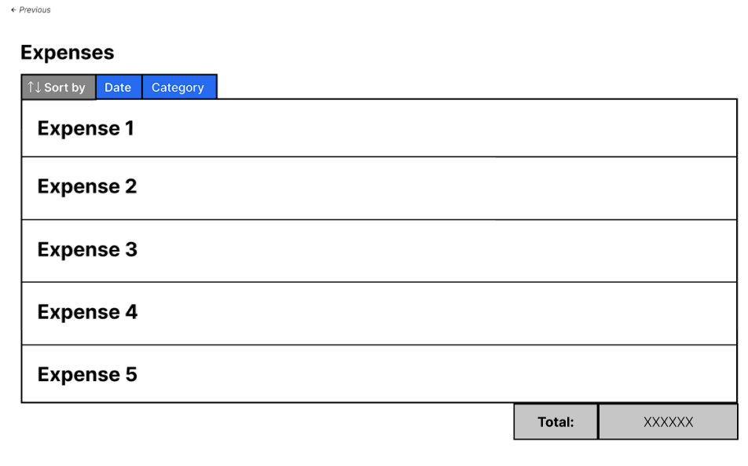
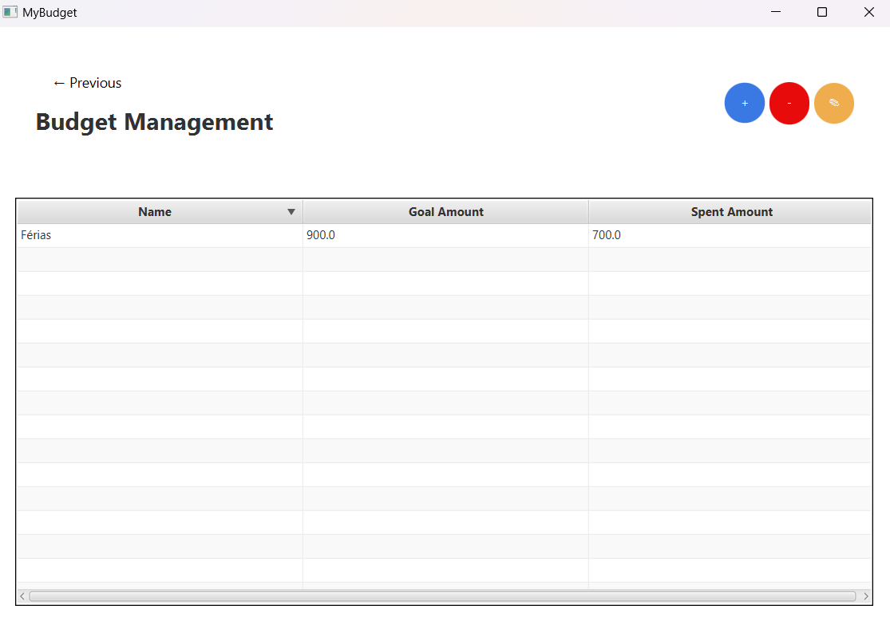
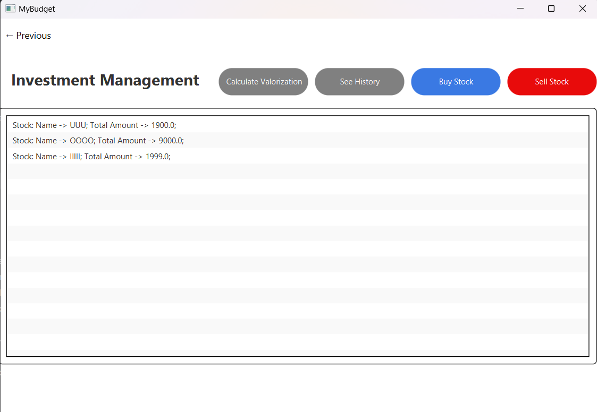
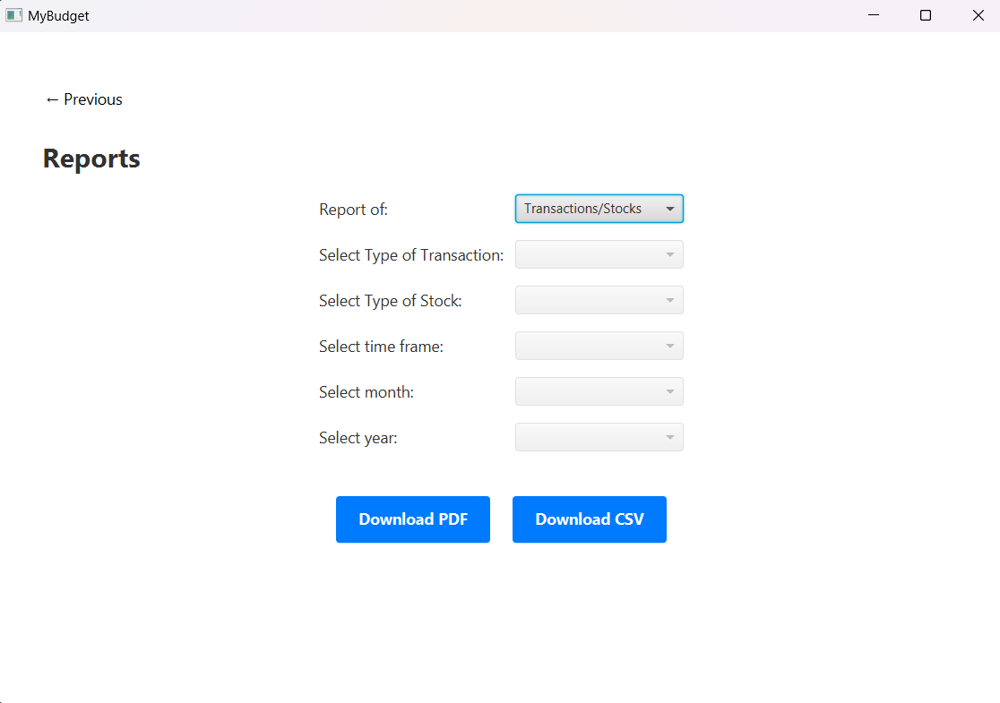
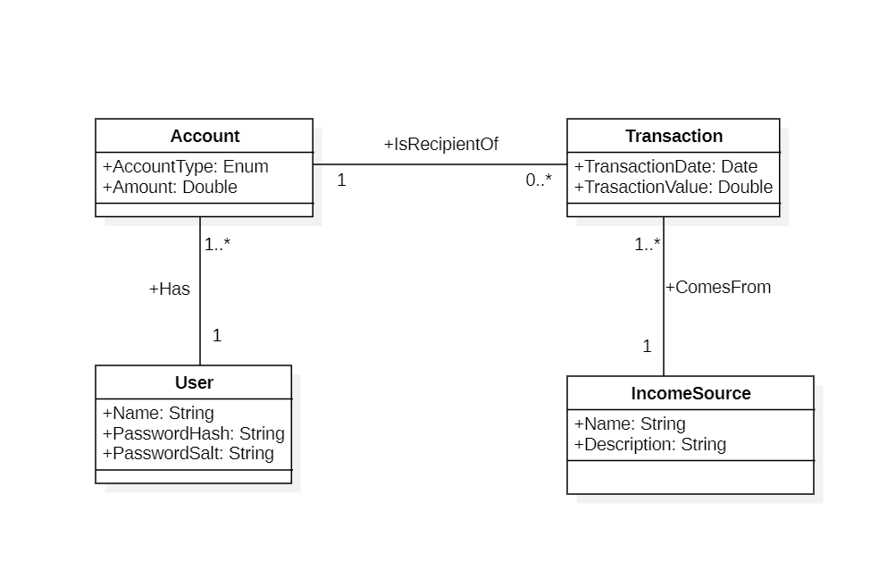
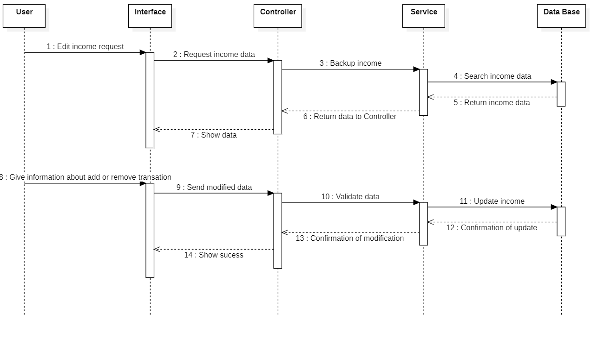

# MyBudget

<!-- 
cmd to run .jar:
 java --module-path "[pathToJavaFx]"--add-modules javafx.controls,javafx.fxml -jar 
[JarFileName]
-->

## Contents

- [Team](#team-22)
- [Vision and Scope](#vision-and-scope)
- [Requirements](#requirements)
    - [Use case diagram](#use-case-diagram)
    - [Mockups](#mockups)
    - [User stories](#user-stories)
- [Definition of Done](#definition-of-done)
- [Architecture and Design](#architecture-and-design)
    - [Domain Model](#domain-model)
- [Risk Plan](#risk-plan)
- [Pre-Game](#pre-game)
- [Release Plan](#release-plan)
  - [Release 1](#release-1)
  - [Release 2](#release-2)
- [Increments](#increments)
  - [Sprint 1](#sprint-1)
  - [Sprint 2](#sprint-2)
  - [Sprint 3](#sprint-3)
  - [Sprint 4](#sprint-4)

## Team 22

- João Pires - 2022134773 - a2022134773@isec.pt
- João Simões - 2022141647 - a2022141647@isec.pt
- João Ventura - 2022119090 - a2022119090@isec.pt
- Rodrigo Gonçalves - 2022145597 - a2022145597@isec.pt
- Ricardo Rodrigues - 2022147797 - a2022147797@isec.pt

***

## Vision and Scope

#### Problem Statement

##### Project background

Planning our financial life can be difficult due to a lack of control over the actions we take with our money. Therefore, with this application, it will be possible to view and monitor transactions made with the user's money in real-time, making it easier to analyze the individual's bank balance.
##### Stakeholders

<!--This is a bulleted list of the stakeholders. Each stakeholder may be referred to by name, title, or role ("support group
manager," "CTO," "senior manager"). The needs of each stakeholder are described in a few sentences.-->
- Banks
- Financial consultants
- Investors

##### Users

- Students
- Couples and families
- Freelancers
- Small entrepreneurs
<!--- User wants to save a certain amount of money in a month
    - Tracking of how much more can they spend to reach their goal
- User wanting to track their habits
    - Wants a simple way to see how much they are sticking to their habits
- User wants to remember when to water their plants
    - Wants an option to add tasks for every few days -->

***

#### Vision & Scope of the Solution

##### Vision statement

The goal of this project is to create an app to simplify the budgests concerns of our audience.  
The app allows the user to keep track of all household souces of income and expenses.  
The users can define spending limits for daily, weekly, and/or monthly expenses or set tasks, whether they are for a specific time or not.  
It is also possible to calculate expected income from several sources such as stocks and bank account interest.
This way, our users can better control their finances.

##### List of features
<!--
Registo de entrada de dinheiro;

Registo de despesas (organizado por datas e/ou categorias);

Controlo do balanço financeiro (despesas sobre receita, criar limites de despesas por um certo período de tempo,...);

Poder gerir todas estas funcionalidades em várias contas/cartões;

Exportação de relatórios sobre os registos (despesas, receita) durante um intervalo de tempo;

Carteira de ações (adicionar e retirar).
-->
- Record money received
- Record expenses (organized by data and/or category)
- Assistence managing personal buget:
  - Check total profits
  - Set maximum spending for a given tive to stay in budget
- Suport for multiple accounts / cards
- Export reports in several formats (i.e. pdf and csv)
- Calculate profit of stock market investments and bank accounts

##### Features that will not be developed

- Emit legaly significant documents (such as receipts)

##### Assumptions

Users will appreciate the value of habit tracking as a personal development tool.
Users are motivated to set clear and achievable goals related to habits and achievements.
Users aspire to change their habits and employ the app as a means to modify their behavior.
Users have varied habits requiring the availability of customization features.
User requirements and preferences can change over time.

***

## Requirements

### Use Case Diagram

***

### Mockups

US1

US2

US3

US4
***

### User Stories

- User story 1 (issue #14)
- User story 2 (issue #15)
- User story 3 (issue #16)
- User story 4 (issue #17)

***

## Definition of done

(This section is already written, do not edit)
It is a collection of criteria that must be completed for a User Story to be considered “done.”

1. All tasks done:
  - CI – built, tested (Junit), reviewed (SonarCloud)
  - Merge request to qa (code review)
2. Acceptance tests passed
3. Accepted by the client
4. Code merged to main

***

<!-- ##### User Story 1

As a student, I want to set deadlines for my assignments so that I can manage my time efficiently.

##### User Story 2
As a user, I want to earn badges for completing tasks so that I can feel a sense of accomplishment.

##### User Story 3
As a fitness enthusiast, I want to track my exercise routines so that I can maintain a consistent workout schedule.

##### User Story 4
As a learner, I want to monitor my study hours so that I can ensure I'm preparing adequately for exams.

##### User Story 5  
As a gardener, I want to set reminders for watering and pruning plants so that I can maintain a healthy garden.

##### User Story 6
As a blogger, I want to set a habit of writing a post every week so that I can engage my audience regularly.

 -->

## Architecture and Design

#### Domain Model

<!---->

#### Sequence diagram

***

## Risk Plan

##### Threshhold of Success
<!---
The project fails if:
 Essential features such as habit tracking, visual progress insights, task and habit management, reminders, and goal setting are incomplete or not functioning as intended.
Users find it difficult to navigate the app or encounter usability issues, leading to dissatisfaction and disengagement.
Reminders are unreliable, causing users to miss their tasks and habits frequently.
Milestone tracking for goals is confusing or not visually represented clearly, leading to user frustration.

- The "must" user stories are not developed
- The app is not in a working condition upon release.
The team is not satisfied with the app and their work on the project, based on a questionare at the last meeting before final release. -->

The project is successful if:
<!--- By the final release date, all essential features, namely habit tracking, task and habit management and reminders, are fully implemented and pass acceptance tests without critical defects.
Users find the app intuitive, user-friendly, and engaging, leading to positive feedback and a high level of satisfaction.
Reminders are delivered accurately and on time, ensuring users can effectively manage their tasks and habits.
Milestone tracking for goals is visually appealing, easy to understand, and provides users with a sense of achievement and progress. -->

- All "must" user stories are developed and tasks assigned to them finished.
- All group members contibuted to the project equally (rounded up to the nearest hour).
- The team is satisfied with the app and their work on the project, based on a questionare at the last meeting before final release.
<!-- - The interface of the app it appealing to most group members and clients. -->

##### Risk List

- RSK1 – PxI: 4x4=16; Inaccurate Financial Calculations or Reporting

  - Risk: Due to lack of experience in financial systems, errors in the code may lead to inaccurate calculations or incorrect financial reports, which can undermine the reliability of the app.
  - Impact: 4
  - Likelihood: 4

- RSK2 – PxI: 3x4=12; Lack of Familiarity with Financial Regulations

  - Risk: The team may not be familiar with legal requirements, compliance standards, or regulations related to financial management, which could lead to issues in regulatory compliance.
  - Impact: 3
  - Likelihood: 4

- RSK3 – PxI: 3x4=12; User Interface and Usability Problems

  - Risk: Designing an intuitive and user-friendly interface for financial management tasks may be challenging for students, leading to a confusing or difficult-to-navigate app.
  - Impact: 3
  - Likelihood: 4

- RSK4 – PxI: 3x3=9; Integration of External Financial APIs

  - Risk: Integrating external APIs (e.g., for banking, accounting, or currency exchange) may be difficult for an inexperienced team, potentially causing delays or malfunctioning features.
  - Impact: 3
  - Likelihood: 3

- RSK5 – PxI: 2x3=6; Testing and Validation of Financial Transactions

  - Risk: Due to lack of experience, insufficient testing could lead to undetected bugs in financial transactions, compromising the reliability of the system.
  - Impact: 2
  - Likelihood: 3

##### Mitigation Actions (threats>=20)
- R1 - Inexperienced Time and Effort Estimation:
  - Action: Conduct Estimation Sessions and Weekly Reviews

- R2 - Inaccurate Financial Calculations or Reporting:
  - Action: Implement Double-Check and Peer Review Process Create a protocol where each financial calculation and report is reviewed by at least one other team member to catch possible mistakes. Additionally, use automated testing for verifying financial calculations.

- R3 - Lack of Familiarity with Financial Regulations: 
  - Action: Consult with Legal Experts or Use Compliance Tools Ensure team members consult with legal experts or use compliance tools and resources to familiarize themselves with relevant financial regulations. Consider adding an external advisor with expertise in financial compliance to the project. 

- R4 - User Interface and Usability Problems:
  - Action: Perform Usability Testing and Get Early Feedback Conduct user research and usability testing sessions with potential users early in the design process. Gathering user feedback and conducting iterative improvements can help ensure the app is intuitive and user-friendly. 

- R5 - Integration of External Financial APIs: 
  - Action: Use Well-Documented APIs and Allocate Time for Learning Prioritize the use of well-documented APIs and dedicate time to study their documentation thoroughly. Engage in proof-of-concept integration with minimal features first, before scaling up.

## Pre-Game
### Sprint 0 Plan

- Goal: description
- Dates: from 10-13/Oct to 24-27/Oct, 2 weeks
- Sprint 0 Backlog (don't edit this list):
  - Task1 – Write Team
  - Task2 – Write V&S
  - Task3 – Write Requirements
  - Task4 – Write DoD
  - Task5 – Write Architecture&Design
  - Task6 – Write Risk Plan
  - Task7 – Write Pre-Game
  - Task8 – Write Release Plan
  - Task9 – Write Product Increments
  - Task10 – Create Product Board
  - Task11 – Create Sprint 0 Board
  - Task12 – Write US in PB, estimate (SML), prioritize (MoSCoW), sort
  - Task13 – Create repository with “GPS Git” Workflow

***

## Release Plan

### Release 1

- Goal:
  - UI implemented
  - Add cards
  - Add and remove transactions
  - Save data
  - List transactions by category
  - Make report of transactions
  
- Dates: 14/Nov
- Team capacity: 4h * 5 elements * 4 weeks =  80 hours
- Release: V1.0

***

### Release 2

- Goal: <!-- Developed US2 and US5. The interface is aestheaticaly pleasing and intuitive. -->
  - Streaks and prizes implemented
  - Calendar with goals/tasks
- Date: 12/Dec
- Team capacity: 4h * 5 elements * 4 weeks =  80 hours
- Release: V2.0

***

## Increments

### Sprint 1
##### Sprint Plan

- Goal: <!-- Create the base architecture of the app and basic interface. -->
  - UI implemented
  - Add cards
  - Add and remove transactions
  - Save data
  - List transactions by category

- Dates: from 17/Oct to 31/Oct, 2 weeks

- Roles:
  - Product Owner: Ricardo Rodrigues
  - Scrum Master: João Simões
  - QA Enginneer: João Pires

- To do:
  - US1: As a user, I want to be able to see the registered transactions registered, organized by category
  
- Story Points: 1L

- Analysis: short analysis of the planning meeting

##### Sprint Review

- Analysis: We managed to implement an application that allows the user to log in and add bank accounts. Unfortunately, the application does not allow the client to add or remove transactions. With that said, looking at our project planning, we made poor estimates. We were too ambitious, did not anticipate the errors during implementation, and ultimately did not manage the implementation time well. All these mistakes are lessons we will consider in the next sprint.

- Story Points: 1L

- Version: 0.1

- Client analysis: 
  - Many things were not done and need to be reviewed and redone. 

- Conclusions:
  - Redo the Sprint1
  - Create sporadic tasks, periodic tasks, priorities and mark as done.
  
##### Sprint Retrospective

- What we did well: 
  - Good communication within the group
  - Keep documentation and progress records up to date

- What we did less well: 
  - Overestimation tasks
  - Improve git knowledge
  - Enhance teamwork skills
  - Improve time management

- How to improve to the next sprint: 
  - Break tasks into subtaks
  - Create individual branch for each dev to avoid mix functional code with potencial errors
  - More talks, more calls, more frequently
  - Mandatorily put time for the project in personal schedule
  

***

### Sprint 2
##### Sprint Plan

- Goal: <!-- Create the base architecture of the app and basic interface. -->
  - Implement the planned items from the previous sprint
  - Make report of transactions

- Dates: from 31/Oct to 14/Nov, 2 weeks

- Roles:
  - Product Owner: João Pires
  - Scrum Master: João Ventura
  - QA Enginneer: Rodrigo Gonçalves

- To do:
  - US1: As a user, I want to be able to see the registered transactions registered, organized by category
  - US4: As a user, I want to export a report with the information relative to a time frame

- Story Points: 1L+1M

- Analysis: short analysis of the planning meeting

##### Sprint Review

- Analysis: We have improved the application both in the graphical interface and in adding and removing bank accounts. In addition, we were able to make bank account details shown in the account information box, add and remove transactions. However, the possibility of downloading reports on the account in PDF and CSV, which was transferred to the next sprint, was missing. We can say that the implementation time was better managed, but the estimates, in addition to having improved, still need to be improved.
- 
- Story Points: 1L

- Version: 0.2

- Client analysis: Practically everything was implemented

- Conclusions:
  - Redo the Sprint2
  - Create sporadic tasks, periodic tasks, priorities and mark as done.
  
##### Sprint Retrospective

- What we did well:
  - Good communication within the group
  - Better project structure(Branches)

- What we did less well:
  - Underestimation 
  - Handling errors in dependencies
  - Handling errors in git pipelines and dependencies

- How to improve to the next sprint:
  - Be more realistic in choosing estimates
  - Spend more time on the spikes
  - Improve git and maven Knowledge

***

#### Sprint 3
##### Sprint Plan

<!--Tasks for sprint 2: more interface, sorting and filtering of tasks by labels and importance, calendar view of history
US4 - history of habits, their completion-->

- Goal: <!-- Create the base architecture of the app and basic interface. -->
  - Streaks and prizes implemented
  - Calendar with goals/tasks
  

- Dates: from 14/Nov to 28/Nov, 2 weeks

- Roles:
  - Product Owner: João Simões
  - Scrum Master: João Pires
  - QA Engennier: João Ventura

- To do:
  - US2: As a user, I want to set spending goals and know how much of it I already used
  - US3: As a user, I want to be able to keep track of my investments
  
- Story Points: 1L + 1M

- Analysis: short analysis of the planning meeting

##### Sprint Review

- Analysis:

- Story Points:

- Version: 0.3

- Client analysis: 

- Conclusions:

##### Sprint Retrospective

- What we did well:
  - Good communication within the group
  - Better project structure(Branches)

- What we did less well:
  - Overestimation

- How to improve to the next sprint:
  - Spend more time improving the interface to improve the user experience
  - Improve the overall project structure

***

#### Sprint 4
##### Sprint Plan

<!--Tasks for sprint 2: more interface, sorting and filtering of tasks by labels and importance, calendar view of history
US4 - history of habits, their completion-->

- Goal: <!-- Create the base architecture of the app and basic interface. -->
  - Improve User experience
  - Implement some new features

- Dates: from 28/Nov to 12/Dec, 2 weeks

- Roles:
  - Product Owner: Rodrigo Gonçalves
  - Scrum Master: Ricardo Rodrigues
  - QA engennier: João Simões

- To do:
  - US4: As a user, I want to export a report with the information relative to a time frame

- Story Points: 1M

##### Sprint Review

- Analysis: We have improved the application by adding the new feature that allows the user to export a report with the information relative to a time frame and by adding new transitions in the application.

- Story Points: 1M

- Version: 0.4

- Client analysis:

- Conclusions: 

##### Sprint Retrospective

- What we did well: 
  - Good communication within the group 
  - Conclusion of the application within the expected time
- What we did less well:
  -
- How to improve to the next sprint:
  - Remove some bugs

***
